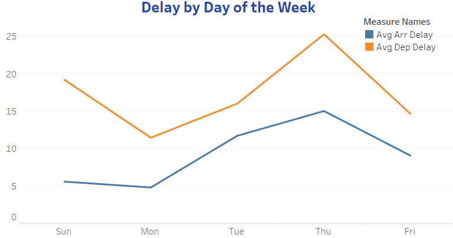

# US Flight Comparison Departure an Arrival Delays
By Jose Angel Gonzalez

## Business Task
### Objective:
- The goal of this project was to compare the trends in arrival and departure delays across different days of the week, enabling an analysis of operational efficency and potential areas for improvement in flight scheduling.

## Data Source:
### Description:
- The analysis utilized flight data from 2018, which included various metrics such as flight numbers, scheduled adn actual departure and arrival times, delays, and the airlines involded. 	
### Tools Used:
- Google BigQuery: used for dta querying and initial processing.
- CVS Imports: Facilitated the integration of data into Tableau.	        		
- Taleau Desktop: Leveraged for creating the dual-axis chart to visualize the data.

## Process
### Data Preparation
- Data was queried and processed to ensure accuracy and relevance.
- The processed data was then exported as CSV files and imported into Tableau for visualization.

### [Click to see Query](flights_2013.sql)

### Insights Derived:
- The dual-axis chart revealed patterns and discrepancies in delays, highlighting specific days with higher delays which could indicate operational bottlenecks.
- The visualization also served as a basis for discussing potential strategic adjustments with stakeholders.

### [Click here to see Dashboard](https://public.tableau.com/app/profile/jose.gonzalez.ramirez/viz/Flights_17262665974290/2013FlightsDashboard)

## Recommendatons:
### Based on the analysis, the following strategies are recommended:
Based on the analysis, several recommendations can be made to airlines and airport authorities to improve performance and reduce delays:
#### 1. Targeted Operational Improvements on High-Delay Days:
Focus on optimizing operations on Thursdays, such as scheduling more resources or implementing stricter time management to address delays. Ground crews and gate agents should be better equipped to handle peak times.
#### 2. Improvement of Turnaround Times:
Given the pattern of longer departure delays, airlines should review their ground handling procedures, such as refueling, boarding, and luggage handling, to improve turnaround times and reduce delays before takeoff.
#### 3. Flight Schedule Optimization:
Airlines could consider adjusting their schedules to reduce flight congestion on specific days like Thursdays. Shifting some flights to days with lower traffic, like Sundays or Fridays, may ease operational pressure.
#### 4. Digital Communication and Passenger Alerts:
Implement better communication systems to alert passengers of potential delays early, thus reducing stress and improving customer satisfaction.
#### 5. Data-Driven Decision Making:
Airlines and airport authorities should regularly analyze delay data and monitor patterns using dashboards to make data-driven decisions. This could be extended beyond annual reviews to quarterly or even monthly assessments.

**By implementing these recommendations, airlines could improve both operational efficiency and customer experience, potentially reducing costs associated with flight delays and increasing overall satisfaction.**

## Conclusion
- The analysis of flight delays across different airlines and days of the week reveals important operational patterns. Notably, Thursdays experience the highest delays, both for departures and arrivals, indicating potential congestion or inefficiencies in flight management during mid-week. In contrast, Sundays and Fridays generally exhibit the least delays, suggesting better performance on these days. The comparison of average delays also highlighted that departure delays tend to be more significant than arrival delays, pointing towards issues with turnaround processes or pre-flight procedures.
- These insights underscore the importance of optimizing operations on high-delay days and improving ground handling efficiency to minimize departure delays. Overall, the data provides a clear view of where airlines and airports can focus efforts to improve punctuality and enhance the passenger experience.

## [Go back to my Webpage](https://grandpa-3.github.io/Jose_AGonzalez.github.io/)

